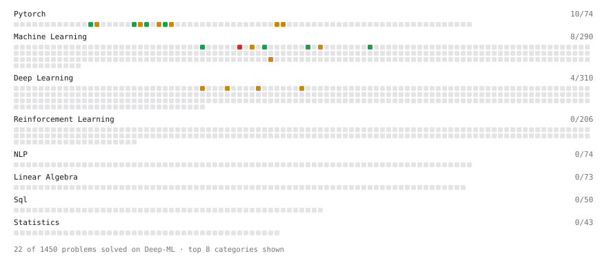

# Deep-ML

My machine learning practice from [Deep-ML](https://www.deep-ml.com). Every solution here was written by hand.

**22** solved · 19 problems · 0 labs · 3 math

[**Browse the interactive portfolio**](https://lagunaseijuro.github.io/deep-ml/) to replay this filling in over time.

## Problems

| | Difficulty | Solved | |
| --- | --- | --- | --- |
| [Cosine LR Schedule with Linear Warmup](https://www.deep-ml.com/problems/910) | easy | 2026-09-24 | [solution](problems/0910-cosine-lr-schedule-with-linear-warmup) |
| [Early Stopping Based on Validation Loss Plateau](https://www.deep-ml.com/problems/199) | easy | 2026-09-23 | [solution](problems/0199-early-stopping-based-on-validation-loss-plateau) |
| [Early Stopping with Patience](https://www.deep-ml.com/problems/913) | easy | 2026-09-24 | [solution](problems/0913-early-stopping-with-patience) |
| [Implement Dropout from Scratch](https://www.deep-ml.com/problems/901) | easy | 2026-09-23 | [solution](problems/0901-implement-dropout-from-scratch) |
| [Implement Early Stopping Based on Validation Loss](https://www.deep-ml.com/problems/135) | easy | 2026-09-23 | [solution](problems/0135-implement-early-stopping-based-on-validation-loss) |
| [Implement LayerNorm from Scratch](https://www.deep-ml.com/problems/908) | easy | 2026-09-23 | [solution](problems/0908-implement-layernorm-from-scratch) |
| [StepLR Learning Rate Scheduler](https://www.deep-ml.com/problems/153) | easy | 2026-09-24 | [solution](problems/0153-steplr-learning-rate-scheduler) |
| [BatchNorm1d Forward in Eval Mode](https://www.deep-ml.com/problems/1231) | medium | 2026-09-23 | [solution](problems/1231-batchnorm1d-forward-in-eval-mode) |
| [CosineAnnealingLR Learning Rate Scheduler](https://www.deep-ml.com/problems/155) | medium | 2026-09-24 | [solution](problems/0155-cosineannealinglr-learning-rate-scheduler) |
| [Dropout in Train vs Eval Mode](https://www.deep-ml.com/problems/1230) | medium | 2026-09-23 | [solution](problems/1230-dropout-in-train-vs-eval-mode) |
| [Dropout Layer](https://www.deep-ml.com/problems/151) | medium | 2026-09-22 | [solution](problems/0151-dropout-layer) |
| [Gradient Accumulation Over Micro-Batches](https://www.deep-ml.com/problems/912) | medium | 2026-09-24 | [solution](problems/0912-gradient-accumulation-over-micro-batches) |
| [Gradient Clipping by Norm](https://www.deep-ml.com/problems/909) | medium | 2026-09-24 | [solution](problems/0909-gradient-clipping-by-norm) |
| [Implement Batch Normalization for BCHW Input](https://www.deep-ml.com/problems/115) | medium | 2026-09-23 | [solution](problems/0115-implement-batch-normalization-for-bchw-input) |
| [Implement BatchNorm2d from Scratch (training mode)](https://www.deep-ml.com/problems/902) | medium | 2026-09-23 | [solution](problems/0902-implement-batchnorm2d-from-scratch-training-mode) |
| [Implement Group Normalization](https://www.deep-ml.com/problems/126) | medium | 2026-09-23 | [solution](problems/0126-implement-group-normalization) |
| [Implement Layer Normalization for Sequence Data](https://www.deep-ml.com/problems/109) | medium | 2026-09-23 | [solution](problems/0109-implement-layer-normalization-for-sequence-data) |
| [Instance Normalization (IN) Implementation](https://www.deep-ml.com/problems/143) | medium | 2026-09-23 | [solution](problems/0143-instance-normalization-in-implementation) |
| [Numerically Stable Cross-Entropy](https://www.deep-ml.com/problems/914) | medium | 2026-09-24 | [solution](problems/0914-numerically-stable-cross-entropy) |

## Math

| | Difficulty | Solved | |
| --- | --- | --- | --- |
| [Optimization: Convexity and Critical Points](https://www.deep-ml.com/math-problems/6) | medium | 2026-09-22 | [solution](math/0006-optimization-convexity-and-critical-points) |
| [Regularization and Generalization](https://www.deep-ml.com/math-problems/31) | medium | 2026-09-22 | [solution](math/0031-regularization-and-generalization) |
| [Taylor Expansions and Local Quadratic Models](https://www.deep-ml.com/math-problems/37) | medium | 2026-09-22 | [solution](math/0037-taylor-expansions-and-local-quadratic-models) |

---

_This file is regenerated by Deep-ML on every push._
