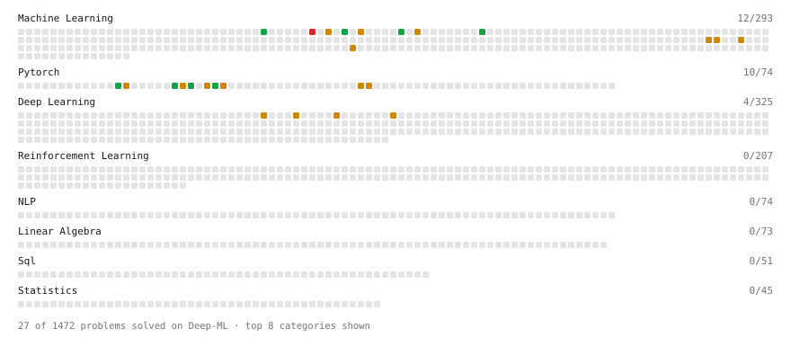

# Deep-ML

My machine learning practice from [Deep-ML](https://www.deep-ml.com). Every solution here was written by hand.

**43** solved · 29 problems · 4 labs · 10 math

[**Browse the interactive portfolio**](https://lagunaseijuro.github.io/deep-ml/) to replay this filling in over time.

## Problems

| | Difficulty | Solved | |
| --- | --- | --- | --- |
| [Cosine LR Schedule with Linear Warmup](https://www.deep-ml.com/problems/910) | easy | 2026-09-24 | [solution](problems/0910-cosine-lr-schedule-with-linear-warmup) |
| [Detect Overfitting or Underfitting](https://www.deep-ml.com/problems/86) | easy | 2026-09-25 | [solution](problems/0086-detect-overfitting-or-underfitting) |
| [Early Stopping Based on Validation Loss Plateau](https://www.deep-ml.com/problems/199) | easy | 2026-09-23 | [solution](problems/0199-early-stopping-based-on-validation-loss-plateau) |
| [Early Stopping with Patience](https://www.deep-ml.com/problems/913) | easy | 2026-09-24 | [solution](problems/0913-early-stopping-with-patience) |
| [Implement Dropout from Scratch](https://www.deep-ml.com/problems/901) | easy | 2026-09-23 | [solution](problems/0901-implement-dropout-from-scratch) |
| [Implement Early Stopping Based on Validation Loss](https://www.deep-ml.com/problems/135) | easy | 2026-09-23 | [solution](problems/0135-implement-early-stopping-based-on-validation-loss) |
| [Implement Gini Impurity Calculation for a Set of Classes](https://www.deep-ml.com/problems/64) | easy | 2026-09-28 | [solution](problems/0064-implement-gini-impurity-calculation-for-a-set-of-classes) |
| [Implement LayerNorm from Scratch](https://www.deep-ml.com/problems/908) | easy | 2026-09-23 | [solution](problems/0908-implement-layernorm-from-scratch) |
| [Implement Weight Decay as L2 Regularization](https://www.deep-ml.com/problems/198) | easy | 2026-09-28 | [solution](problems/0198-implement-weight-decay-as-l2-regularization) |
| [StepLR Learning Rate Scheduler](https://www.deep-ml.com/problems/153) | easy | 2026-09-24 | [solution](problems/0153-steplr-learning-rate-scheduler) |
| [BatchNorm1d Forward in Eval Mode](https://www.deep-ml.com/problems/1231) | medium | 2026-09-23 | [solution](problems/1231-batchnorm1d-forward-in-eval-mode) |
| [Bias-Variance Decomposition from Bootstrap](https://www.deep-ml.com/problems/804) | medium | 2026-09-28 | [solution](problems/0804-bias-variance-decomposition-from-bootstrap) |
| [CosineAnnealingLR Learning Rate Scheduler](https://www.deep-ml.com/problems/155) | medium | 2026-09-24 | [solution](problems/0155-cosineannealinglr-learning-rate-scheduler) |
| [Dropout in Train vs Eval Mode](https://www.deep-ml.com/problems/1230) | medium | 2026-09-23 | [solution](problems/1230-dropout-in-train-vs-eval-mode) |
| [Dropout Layer](https://www.deep-ml.com/problems/151) | medium | 2026-09-22 | [solution](problems/0151-dropout-layer) |
| [Elastic Net Regression via Gradient Descent](https://www.deep-ml.com/problems/139) | medium | 2026-09-28 | [solution](problems/0139-elastic-net-regression-via-gradient-descent) |
| [Find the Best Gini-Based Split for a Binary Decision Tree](https://www.deep-ml.com/problems/138) | medium | 2026-09-28 | [solution](problems/0138-find-the-best-gini-based-split-for-a-binary-decision-tree) |
| [Gradient Accumulation Over Micro-Batches](https://www.deep-ml.com/problems/912) | medium | 2026-09-24 | [solution](problems/0912-gradient-accumulation-over-micro-batches) |
| [Gradient Clipping by Norm](https://www.deep-ml.com/problems/909) | medium | 2026-09-24 | [solution](problems/0909-gradient-clipping-by-norm) |
| [Implement Batch Normalization for BCHW Input](https://www.deep-ml.com/problems/115) | medium | 2026-09-23 | [solution](problems/0115-implement-batch-normalization-for-bchw-input) |
| [Implement BatchNorm2d from Scratch (training mode)](https://www.deep-ml.com/problems/902) | medium | 2026-09-23 | [solution](problems/0902-implement-batchnorm2d-from-scratch-training-mode) |
| [Implement Group Normalization](https://www.deep-ml.com/problems/126) | medium | 2026-09-23 | [solution](problems/0126-implement-group-normalization) |
| [Implement Layer Normalization for Sequence Data](https://www.deep-ml.com/problems/109) | medium | 2026-09-23 | [solution](problems/0109-implement-layer-normalization-for-sequence-data) |
| [Instance Normalization (IN) Implementation](https://www.deep-ml.com/problems/143) | medium | 2026-09-23 | [solution](problems/0143-instance-normalization-in-implementation) |
| [Learning Curve Generator for Bias-Variance Diagnosis](https://www.deep-ml.com/problems/800) | medium | 2026-09-28 | [solution](problems/0800-learning-curve-generator-for-bias-variance-diagnosis) |
| [Numerically Stable Cross-Entropy](https://www.deep-ml.com/problems/914) | medium | 2026-09-24 | [solution](problems/0914-numerically-stable-cross-entropy) |
| [Polynomial Regression Fit](https://www.deep-ml.com/problems/801) | medium | 2026-09-28 | [solution](problems/0801-polynomial-regression-fit) |
| [Precision and Recall at Threshold](https://www.deep-ml.com/problems/849) | medium | 2026-09-25 | [solution](problems/0849-precision-and-recall-at-threshold) |
| [Train Logistic Regression with Gradient Descent](https://www.deep-ml.com/problems/106) | hard | 2026-09-25 | [solution](problems/0106-train-logistic-regression-with-gradient-descent) |

## Labs

| | Difficulty | Solved | |
| --- | --- | --- | --- |
| [Split the Data Honestly and Beat a Baseline](https://www.deep-ml.com/labs/3d26c3f9-cb73-4ab1-bc4d-86cfab2af6d1) | easy | 2026-09-25 | [solution](labs/3d26c3f9-cb73-4ab1-bc4d-86cfab2af6d1-split-the-data-honestly-and-beat-a-baseline) |
| [Train a Binary Classifier](https://www.deep-ml.com/labs/23) | easy | 2026-09-26 | [solution](labs/0023-train-a-binary-classifier) |
| [Train a Linear Regression Model](https://www.deep-ml.com/labs/18) | easy | 2026-09-26 | [solution](labs/0018-train-a-linear-regression-model) |
| [MLP with Dropout and BatchNorm](https://www.deep-ml.com/labs/3480fd6b-ee7a-4afd-ba4b-5c934aeab10b) | medium | 2026-09-24 | [solution](labs/3480fd6b-ee7a-4afd-ba4b-5c934aeab10b-mlp-with-dropout-and-batchnorm) |

## Math

| | Difficulty | Solved | |
| --- | --- | --- | --- |
| [Model Selection: CV, AIC, and BIC](https://www.deep-ml.com/math-problems/43) | easy | 2026-09-28 | [solution](math/0043-model-selection-cv-aic-and-bic) |
| [Bias–Variance Decomposition](https://www.deep-ml.com/math-problems/39) | medium | 2026-09-28 | [solution](math/0039-bias-variance-decomposition) |
| [Covariance and Correlation](https://www.deep-ml.com/math-problems/17) | medium | 2026-09-28 | [solution](math/0017-covariance-and-correlation) |
| [Information Theory: Entropy](https://www.deep-ml.com/math-problems/24) | medium | 2026-09-28 | [solution](math/0024-information-theory-entropy) |
| [Logistic Regression as Maximum Likelihood](https://www.deep-ml.com/math-problems/40) | medium | 2026-09-25 | [solution](math/0040-logistic-regression-as-maximum-likelihood) |
| [Optimization: Convexity and Critical Points](https://www.deep-ml.com/math-problems/6) | medium | 2026-09-22 | [solution](math/0006-optimization-convexity-and-critical-points) |
| [Regularization and Generalization](https://www.deep-ml.com/math-problems/31) | medium | 2026-09-22 | [solution](math/0031-regularization-and-generalization) |
| [Taylor Expansions and Local Quadratic Models](https://www.deep-ml.com/math-problems/37) | medium | 2026-09-22 | [solution](math/0037-taylor-expansions-and-local-quadratic-models) |
| [Eigendecomposition and SVD](https://www.deep-ml.com/math-problems/16) | hard | 2026-09-28 | [solution](math/0016-eigendecomposition-and-svd) |
| [Maximum Likelihood and MAP](https://www.deep-ml.com/math-problems/26) | hard | 2026-09-28 | [solution](math/0026-maximum-likelihood-and-map) |

---

_This file is regenerated by Deep-ML on every push._
